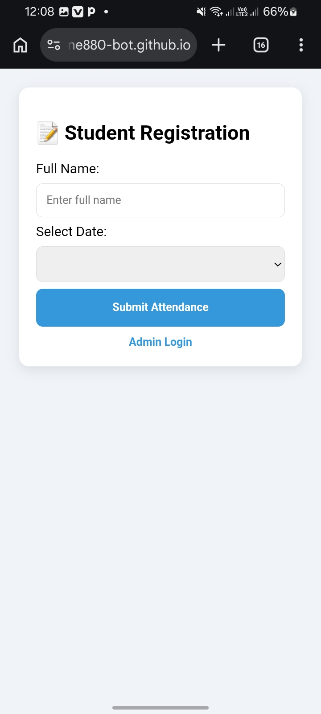

# 🎓 Student Attendance System

A modern, real-time student attendance tracking system built with **HTML5, CSS3, JavaScript, and Firebase**. This app allows students to register their attendance easily while providing an admin dashboard for management.

---

## 📸 Screenshots

### 🖥️ Admin & Student Interface

---

## ✨ Features
*   **Real-time Database:** Powered by Firebase for instant updates.
*   **Student Registration:** Simple form for students to log their attendance.
*   **Admin Dashboard:** Secure login for admins to view and manage attendance records.
*   **Export to CSV:** Admins can download attendance reports as Excel/CSV files.
*   **Responsive Design:** Works perfectly on Mobile, Tablet, and Desktop.

---

## 🚀 Live Demo
You can access the live application here:
[https://zerihundagne880-bot.github.io/student-attendance-system-1/](https://zerihundagne880-bot.github.io/student-attendance-system-1/)

---

## 🛠️ Technologies Used
*   **Frontend:** HTML5, CSS3 (Flexbox/Grid), JavaScript (ES6+)
*   **Backend:** Firebase Realtime Database
*   **Hosting:** GitHub Pages

---

## 👤 Developer
**Zerihun Dagne**
*   **Email:** [zerihundagne880@gmail.com](mailto:zerihundagne880@gmail.com)
*   **GitHub:** [@zerihundagne880-bot](https://github.com/zerihundagne880-bot)

---

## 📝 License
This project is open-source and available under the MIT License.
